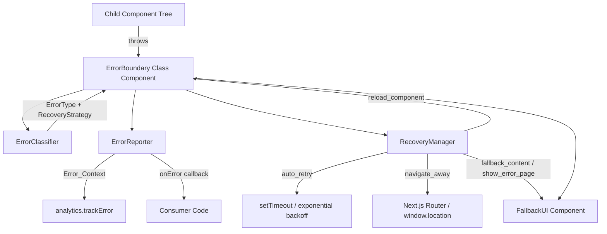

# Design Document: Error Boundary Recovery

## Overview

This design replaces the existing basic `ErrorBoundary` component with an intelligent, composable error boundary system for the Soroban Ajo Next.js 14 / TypeScript / Tailwind CSS frontend. The system classifies errors by type, selects and executes appropriate recovery strategies, reports structured error context to the analytics service, and renders accessible, user-friendly fallback UI.

The new system is a strict superset of the existing `ErrorBoundary` interface — all existing usages (`children`, `fallback`, `onError`) continue to work without modification.

### Key Design Decisions

- **Class component for the boundary itself**: React's `componentDidCatch` / `getDerivedStateFromError` lifecycle methods are only available on class components. All other modules are plain TypeScript functions/objects.
- **Separation of concerns via three focused modules**: `ErrorClassifier`, `ErrorReporter`, and `RecoveryManager` are pure/side-effect-isolated modules that the class component orchestrates. This makes each independently testable.
- **Strategy override at the prop level**: Developers can override the classifier's default strategy via the `strategy` prop, enabling declarative per-boundary configuration without subclassing.
- **Exponential backoff in the Recovery Manager**: Retry delay = `1000ms * 2^retryCount`, matching the existing implementation and the requirements.

---

## Architecture



### Module Responsibilities

| Module | Responsibility |
|---|---|
| `ErrorBoundary` | React class component; orchestrates classifier, reporter, recovery manager; manages state |
| `ErrorClassifier` | Pure function: `Error → { errorType, recoveryStrategy }` |
| `ErrorReporter` | Side-effectful module: builds `Error_Context`, calls `analytics.trackError`, invokes `onError` prop |
| `RecoveryManager` | Manages retry timers, state transitions, navigation |
| `FallbackUI` | Functional React component rendering all error states |
| `errorMessages` | Constant map of `ErrorType → user-friendly string` |

---

## Components and Interfaces

### Public Types

```typescript
export type ErrorType =
  | 'component'
  | 'network'
  | 'api'
  | 'validation'
  | 'permission'
  | 'timeout'
  | 'unknown'

export type RecoveryStrategy =
  | 'auto_retry'
  | 'fallback_content'
  | 'reload_component'
  | 'navigate_away'
  | 'show_error_page'

export interface ErrorContext {
  errorType: ErrorType
  message: string
  stack?: string
  componentStack?: string
  retryCount: number
  timestamp: string        // ISO 8601
  url: string
  userId?: string
  sessionId: string
}
```

### ErrorBoundary Props

```typescript
export interface ErrorBoundaryProps {
  children: React.ReactNode

  // --- backward-compatible props (existing interface) ---
  fallback?: React.ReactNode
  onError?: (error: Error, errorInfo: React.ErrorInfo, context: ErrorContext) => void

  // --- new configuration props ---
  strategy?: RecoveryStrategy          // overrides classifier default
  errorTypes?: ErrorType[]             // restrict which types this boundary handles
  maxRetries?: number                  // default: 3
  navigateAwayPath?: string            // default: '/'
}
```

### ErrorBoundary State

```typescript
interface ErrorBoundaryState {
  hasError: boolean
  error?: Error
  errorInfo?: React.ErrorInfo
  errorType: ErrorType
  recoveryStrategy: RecoveryStrategy
  retryCount: number
  isRecovering: boolean
}
```

### ErrorClassifier

```typescript
// Pure function — no side effects
export function classifyError(error: Error): {
  errorType: ErrorType
  recoveryStrategy: RecoveryStrategy
}
```

Classification is pattern-matching against `error.message` and `error.name` using the priority order: `network` → `api` → `timeout` → `permission` → `validation` → `component` → `unknown`. The default strategy mapping is encoded as a constant.

### ErrorReporter

```typescript
export function buildErrorContext(
  error: Error,
  errorInfo: React.ErrorInfo,
  errorType: ErrorType,
  retryCount: number
): ErrorContext

export function reportError(
  error: Error,
  errorInfo: React.ErrorInfo,
  context: ErrorContext
): void
// calls analytics.trackError, console.group in dev

export function reportRecoveryAttempt(
  errorType: ErrorType,
  retryCount: number,
  strategy: RecoveryStrategy
): void
```

### FallbackUI

```typescript
interface FallbackUIProps {
  errorType: ErrorType
  recoveryStrategy: RecoveryStrategy
  retryCount: number
  maxRetries: number
  isRecovering: boolean
  sessionId: string
  error?: Error           // only used in dev for stack trace
  onRetry: () => void
  onReset: () => void
}

export function FallbackUI(props: FallbackUIProps): JSX.Element
```

---

## Data Models

### Error_Context Object

```typescript
{
  errorType: 'network',
  message: 'Failed to fetch',
  stack: 'Error: Failed to fetch\n    at ...',
  componentStack: '\n    in PaymentForm\n    in App',
  retryCount: 1,
  timestamp: '2024-01-15T10:30:00.000Z',
  url: 'https://app.sorobanajo.com/groups/123',
  userId: 'user_abc123',          // from analytics.getStats().userId
  sessionId: '1705312200000-x7k9m'  // from analytics.getStats().sessionId
}
```

### ErrorType → RecoveryStrategy Default Mapping

| ErrorType | Default RecoveryStrategy |
|---|---|
| `network` | `auto_retry` |
| `api` | `auto_retry` |
| `timeout` | `auto_retry` |
| `validation` | `fallback_content` |
| `permission` | `navigate_away` |
| `component` | `reload_component` |
| `unknown` | `show_error_page` |

### ErrorType → User-Friendly Message Mapping

| ErrorType | Message |
|---|---|
| `network` | "Network connection issue. Please check your internet connection." |
| `api` | "We're having trouble reaching our servers. Please try again shortly." |
| `timeout` | "The request took too long. Please try again." |
| `validation` | "Something doesn't look right. Please refresh and try again." |
| `permission` | "You don't have permission to view this content." |
| `component` | "Part of this page failed to load." |
| `unknown` | "An unexpected error occurred. Our team has been notified." |

### Retry Backoff Schedule (maxRetries=3, base=1000ms)

| Attempt | Delay |
|---|---|
| 1st retry | 1000ms |
| 2nd retry | 2000ms |
| 3rd retry | 4000ms |
| Exhausted | → `show_error_page` |

---

## Correctness Properties

*A property is a characteristic or behavior that should hold true across all valid executions of a system — essentially, a formal statement about what the system should do. Properties serve as the bridge between human-readable specifications and machine-verifiable correctness guarantees.*

